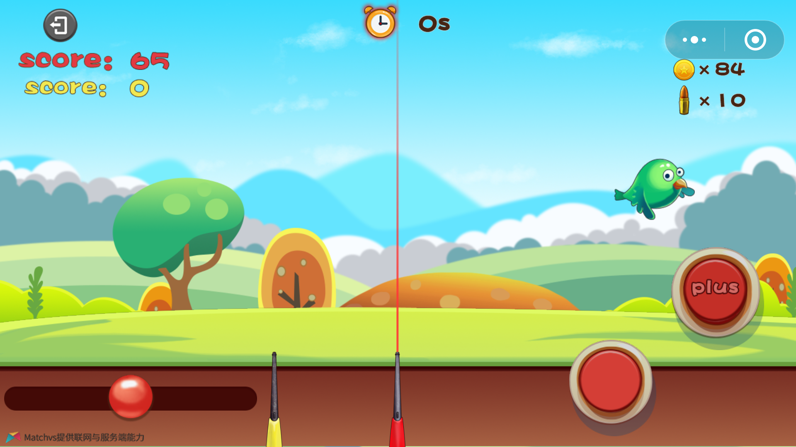
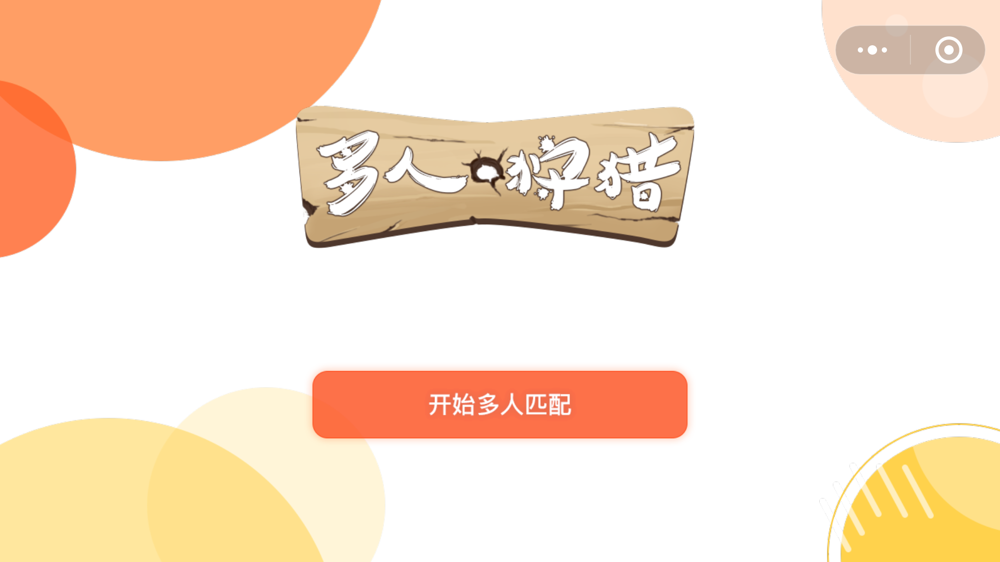

 《多人狩猎》-- 如何快速开发时下火爆的微信小游戏 .md

[TOC]

## 游戏介绍

### 简介

​    《多人狩猎》是一款休闲娱乐类游戏 , 基本规则是左右移动枪的射击方向 , 点击红点按钮或点击puls按钮射击 , 红色为子弹攻击,大只鸭子需要多发子弹方可打下 , 而puls是消耗金币攻击,可以一枪打下鸭子 , 时间为60S , 根据哪个玩家积分多则获胜 , 玩法简单有趣 , 给你带来不一样的体验！



### 游戏特色

1、 在线同屏竞技、实时匹配

2、 玩法经典、老少皆宜

3、 场次分明、一分高下

### 游戏截图



体验地址:

1. 微信二维码
2. 官网链接

源代码下载地址:
1. 官网下载地址
2. github下载地址:https://github.com/matchvs/DuckHunt

## 那么如何快速开发上述这样的小游戏?


### 1.选用好的工具


1. Cocos Creator     -- 微信小游戏/H5游戏前端表现解决方案
2. Matchvs               -- 微信小游戏/H5游戏联网后端解决方案

选用上述两个产品解决游戏创作到游戏发布过程中的一揽子问题.

##### 下载上述两个工具:

1. Cocos Creator 下载地址
2. Matchvs JavaScript SDK 下载地址

##### 下载好后安装上述两个工具,做好准备工作:

1. Matchvs JavaScript 的Cocos Creator 插件使用手册

### 2.游戏主要功能实现

#### 设计游戏实现步骤

拆分主要功能:

1. 用户登录
2. 随机匹配和创建房间
3. 同屏游戏

##### 用户登录

​    使用Cocos Creator(以下简称CC)创建游戏登录场景

​    使用CC 拖动控件, 还原设计稿 , 依托CC的良好的工作流,使得这部分的工作可以由游戏策划或者UI设计者来完成,程序开发者只需要在场景中挂载相应的游戏逻辑脚本. 举个例子,在登录按钮挂在一个`uiLogin.js`的脚本完成用户登录功能.

uilogin.fire


新建一个uiLogin.js,按 1,2,3 三个步骤挂载到场景中.

1. 新建js脚本文件
2. 选中场景任一控件
3. 添加组件,选中刚新建的脚本,
4. 在脚本的`on'Load`函数中给按钮添加点击监听,触发登录操作

```javscript
onLoad() {
      this.nodeDict["start"].on("click", this.startGame, this);
}
```


实现`this.startGame`函数. 登录之前需要初始化`Matchvs SDK`:

uiLogin.js

``` javascript
uiLogin.js
---

var uiPanel = require("uiPanel");
cc.Class({
    extends: uiPanel,
    properties: {},

    onLoad() {
        this._super();
        this.nodeDict["start"].on("click", this.startGame, this);
    },

    startGame() {
        Game.GameManager.matchVsInit();
    }
});


Game.GameManager.js
-----
matchVsInit: function() {
        mvs.response.initResponse = this.initResponse.bind(this);
        mvs.response.errorResponse = this.errorResponse.bind(this);
        // 用户登录之后的回调
        mvs.response.loginResponse = this.loginResponse.bind(this); 

        var result = mvs.engine.init(mvs.response, GLB.channel, GLB.platform, GLB.gameId);
        if (result !== 0) {
            console.log('初始化失败,错误码:' + result);
        }
}
```

初始化需要的几个参数在Matchvs官网注册即可得到,注册地址 http://matchvs.com

```text
    channel: 'MatchVS',
    platform: 'alpha',
    gameId: 201331,
    gameVersion: 1,
    appKey: '17ffc6d5f1e14a04b99c4bf17addc411',
    secret: '4cc0d042cd5547e98860728bb3207650',
```

登录Matchvs游戏云,返回UserID,登录成功.
```JavaScript

    registerUserResponse: function(userInfo) {
        var deviceId = 'abcdef';
        var gatewayId = 0;
        GLB.userInfo = userInfo;

        console.log('开始登录,用户Id:' + userInfo.id)

        var result = mvs.engine.login(
            userInfo.id, userInfo.token,
            GLB.gameId, GLB.gameVersion,
            GLB.appKey, GLB.secret,
            deviceId, gatewayId
        );
        if (result !== 0) {
            console.log('登录失败,错误码:' + result);
        }
    },

    loginResponse: function(info) {
        if (info.status !== 200) {
            console.log('登录失败,异步回调错误码:' + info.status);
        } else {
            console.log('登录成功');
            this.lobbyShow();
        }
    },
```

##### 随机匹配和创建房间

  使用CC创建大厅场景(uiLobbyPanel.fire)给用户选择匹配方式,创建匹配场景(uiMatching1v1.fire) 给用户反馈比配进度


  和登录功能的实现步骤类似:写一个 `uiMatching1v1.js`脚本挂在到场景中的控件上.

```javascript
uiMatching1v1.js
----
    joinRandomRoom: function() {
        var result = mvs.engine.joinRandomRoom(GLB.MAX_PLAYER_COUNT, '');
        if (result !== 0) {
            console.log('进入房间失败,错误码:' + result);
        }
    },
```

通过监听`joinRoomResponse`和`joinRoomNotify`匹配结果

```javascript
gameManager.js
---
joinRoomResponse: function(status, roomUserInfoList, roomInfo) {
        if (status !== 200) {
            console.log("失败 joinRoomResponse:" + status);
            return;
        }
        var data = {
            status: status,
            roomUserInfoList: roomUserInfoList,
            roomInfo: roomInfo
        }
        clientEvent.dispatch(clientEvent.eventType.joinRoomResponse, data);
},

joinRoomNotify: function(roomUserInfo) {
        var data = {
            roomUserInfo: roomUserInfo
        }
        clientEvent.dispatch(clientEvent.eventType.joinRoomNotify, data);
},
```


##### 同屏游戏 , 实现游戏同步

还是按照上面的套路,新建场景(uiGamePanel.fire),挂在脚本(uiGamePanel.js).
攻击的动作使用Matchvs 的 `sendEventEx`发出,


```javascript

        this.fireBigBtn.node.on("click", function() {
            // 金币兑换子弹是否足够--
            if (Game.GameManager.gameState !== GameState.Play) {
                return;
            }
            if (Game.GameManager.coin >= 1 && this.fireCd <= 0) {
                Game.GameManager.coin--;
                this.nodeDict["coin"].getComponent(cc.Animation).play();
                this.fireCd = 0.5;
                var msg = {
                    action: GLB.PLAYER_FIRE_EVENT,
                    bulletType: BulletType.Special
                };
                Game.GameManager.sendEventEx(msg);
                cc.audioEngine.play(this.firePlusAudio, false, 1);
                clientEvent.dispatch(clientEvent.eventType.updateCoin);
            }
        }, this);
```

另一方的客户端收到后处理加分,播放击中动画等事情;

``` javascript
 // 玩家行为通知--
    sendEventNotify: function(info) {
        var cpProto = JSON.parse(info.cpProto);

        if (info.cpProto.indexOf(GLB.GAME_START_EVENT) >= 0) {
            GLB.playerUserIds = [GLB.userInfo.id]
            this.scores = [];
            var self = this;
            var remoteUserIds = JSON.parse(info.cpProto).userIds;
            remoteUserIds.forEach(function(id) {
                if (GLB.userInfo.id !== id) {
                    GLB.playerUserIds.push(id)
                }
                var score = {
                    playerId: id,
                    score: 0
                }
                self.scores.push(score);
            });
            this.startGame();
        }

      ....
            clientEvent.dispatch(clientEvent.eventType.roundStart);
        }
    },

```

## 最后一公里 - 发布上线 

  开发完成后， 再通过CC的一键发布微信小游戏功能上线微信。我们的下一个可能火爆的微信小游戏开发上线完成了 ，完美 close！

  通过CC和Matchvs的这两套解决方案，我们的游戏从idea阶段到发布上线一气呵成，完全不考虑打包，上线，服务器租赁，服务端开发，域名购买，上线维护等等等等其他事情，这使得开发者专注于游戏的品质打磨，创意的实现。perfect！

